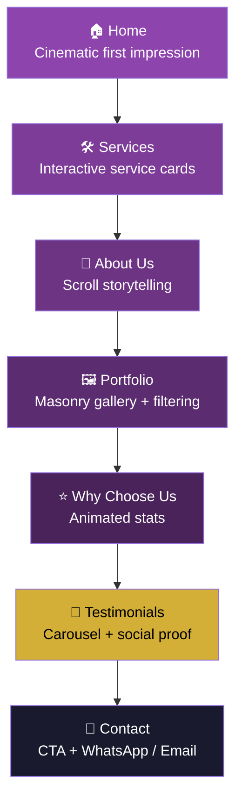
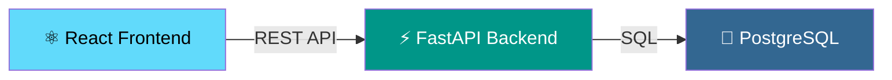
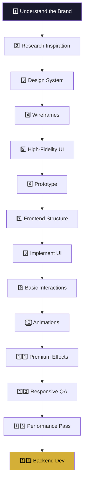

<div align="center">

 
[](https://react.dev)
[](https://vitejs.dev)
[](https://tailwindcss.com)
[](https://www.framer.com/motion)
[](https://gsap.com)
[](https://figma.com)
 
**Status:** 🎨 Design Phase &nbsp;|&nbsp; **Priority:** Frontend Experience &nbsp;|&nbsp; **Backend:** Deferred (Phase 2)
 
</div>
---
 
## 📖 Table of Contents
 
- [Vision](#-vision)
- [Business Scope](#-business-scope)
- [Site Structure](#-site-structure)
- [User Journey](#-user-journey)
- [Design Philosophy](#-design-philosophy)
- [Tech Stack](#-tech-stack)
- [Animation Ownership](#-animation-ownership-read-this-before-writing-code)
- [Architecture (Future Backend)](#-architecture-future-backend)
- [Development Roadmap](#-development-roadmap)
- [Performance Budget](#-performance-budget-non-negotiable)
- [Getting Started](#-getting-started)
---
 
## 🎯 Vision
 
> *"If the decorator can create a website experience this beautiful, imagine what they can create in real life."*
 
A visually immersive frontend for a decoration & event styling business — built to communicate **creativity, elegance, professionalism, and trust** before a single word is read.
 
**Not a static business site.** A portfolio-first, motion-driven brand experience.
 
---
 
## 🏢 Business Scope
 
| | Products | Services |
|---|---|---|
| 🎀 | Wedding decoration materials | Wedding decoration |
| 🪟 | Curtains | Event decoration |
| 🏺 | Vases | Interior decoration |
| 💡 | Lighting | Space styling |
| 🪑 | Furniture | Special occasion decoration |
| 🎪 | Event equipment | — |
| 🖼️ | Wall decorations | — |
 
**Product catalogue, cart, and payments are explicitly Phase 2** — do not let scope creep pull e-commerce into the frontend-first phase.
 
---
 
## 🗺️ Site Structure
 
```
Home → Services → About Us → Portfolio → Why Choose Us → Testimonials → Contact
```
 
## 🔄 User Journey
 

 
---
 
## 🎨 Design Philosophy
 
| Principle | Meaning |
|---|---|
| **Visual First** | High-quality imagery, typography, and composition carry the brand — not copy. |
| **Animation With Purpose** | Every animation guides attention, reveals content, or adds depth. Never decorative-only. |
| **Premium Simplicity** | `Minimalism + Creativity + Animation + Elegance` — restraint is part of luxury, not the opposite of it. |
| **Strong Storytelling** | The scroll is a narrative arc, not a list of sections. |
 
---
 
## 🧰 Tech Stack
 
| Layer | Technology | Purpose |
|---|---|---|
| 🧱 Core | React + Vite | App shell, fast dev/build |
| 🎨 Styling | Tailwind CSS + CSS | Utility-first + custom fine control |
| 🎬 Micro-interactions | Framer Motion | Hover, layout transitions, component-level motion |
| 🎥 Scroll & Timeline | GSAP + ScrollTrigger | Pinned sections, parallax, cinematic sequences |
| 🖱️ Smooth Scroll | Lenis | Inertia scrolling — **must be synced to GSAP** (see below) |
| 🖼️ Sliders | Swiper | Testimonials, galleries, mobile carousels |
| 🧿 Icons | Lucide React | Consistent interface iconography |
| 🧊 3D (Phase 1.5, conditional) | React Three Fiber / Spline | Only if a specific hero/product moment justifies the payload cost |
| 🗂️ Design | Figma | Wireframes → high-fidelity → prototype |
| ⚙️ Future Backend | Python, FastAPI, PostgreSQL | Deferred — see architecture below |
 
## ⚠️ Animation Ownership (read this before writing code)
 
Stacking Framer Motion, GSAP, and Lenis without boundaries produces jank and fights over the same elements. Fixed division of labor:
 
- **Framer Motion** → component-level micro-interactions (buttons, hover states, small layout shifts)
- **GSAP + ScrollTrigger** → all scroll-driven animation (reveals, pinning, parallax, cinematic sequences)
- **Lenis** → scroll physics only, explicitly wired to ScrollTrigger's update loop — never left to run independently alongside ScrollTrigger
No element is animated by more than one library at a time.
 
---
 
## 🏗️ Architecture (Future Backend)
 

 
Introduced **after** the frontend experience, brand identity, and content structure are locked — not before.
 
---
 
## 🚀 Development Roadmap
 

 
---
 
## ⚡ Performance Budget (non-negotiable)
 
A slow "premium" site reads as amateur, not luxury. Fixed targets, checked at every phase — not left to Layer 6:
 
| Metric | Target |
|---|---|
| Largest Contentful Paint (LCP) | < 2.5s on 4G |
| Total JS (pre-code-split) | < 300kb |
| Hero media | Compressed/responsive `<picture>` or adaptive video, never a raw 4K asset |
| Animation | 60fps or degrade gracefully — no motion at the cost of scroll jank |
 
---
 
## 🏁 Getting Started
 
```bash
git clone <repo-url>
cd luxe-decor-frontend
npm install
npm run dev
```
 
### Prerequisites
 
- Node.js ≥ 18
- npm
- Figma access (for design handoff)
---
 
<div align="center">

